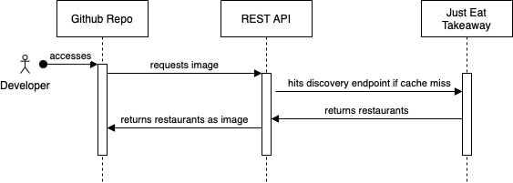

# README Restaurants

**Our mission:** create a global food discovery service for hungry developers 🍕


## What is this?

This is a simple REST API that allows you to embed restaurants into your Github README.

Endpoint: `https://capybara-gq2i.onrender.com/api/v1/restaurants/bypostalcode/:postal_code/svg`

Usage:

```

```

### Demo

Want to try this out with your own postcode? Here is a playground for you: [Just create a new issue](https://github.com/geniegeist/capybara/issues/new/choose), enter the postcode and discover restaraunts while browsing Github repositories 😊

### Is this production ready?

Sure, I truely believe this will revolutionize Github and turn it into a global food discovery service for hungry developers.

### Features

- Embed restaurants into your Github README ✅
- Link to restaurant websites ✅
- Custom themes ✅
- Animations ✅
- Limit number of restaurants ✅
- Order by rating ✅
- Cache ✅
- 404 ✅

### Known issues

- Only works with UK postcodes
- Not mobile friendly

## API

### Available parameters

All parameters are optional.

#### limit

- number of restaurants to display
- default is 10
- max is 10

Example: `https://capybara-gq2i.onrender.com/api/v1/restaurants/bypostalcode/m11ag/svg?limit=1`


#### orderby

- possible values: `rating`
- note that it first selects restaurants, then orders them (it does not order all restaurants by rating and then select them)

Example: `https://capybara-gq2i.onrender.com/api/v1/restaurants/bypostalcode/ox1/svg?orderby=rating`


#### theme

- possible values: `default`, `bim`, `github-dark`, `github-light`, `wild-cherry`

Example: `https://capybara-gq2i.onrender.com/api/v1/restaurants/bypostalcode/BN11AD/svg?theme=github-light`

bim


github-dark


github-light


wild-cherry


### 404

When no restaurants are found, a 404 image is returned.


## Assignment Criteria for JET challenge

### Installation

1. Clone this repository
2. Run `pnpm install` (alternatively `npm install`)
3. Create a `.env` file with the following content:

```
CACHE_MAX_AGE=0
API_ENDPOINT=https://uk.api.just-eat.io/discovery/uk/restaurants/enriched/bypostcode/
```

4. Run `pnpm dev` (alternatively `npm run dev`)

### Architecture



### Assumptions

- There is a request limit for the JET API; hence a cache is implemented to reduce the number of requests
- The discovery endpoint of JET API displays the most relevant restaurants first; hence we do not need to sort the restaurants
- The JET API may return closed restaurants; hence we show an indicator in the image if a restaurant is closed
- Displaying data in an appealing way is important; hence we added animations and a cool monospace font
- The target audience is a hungry developer; hence themes are available since developers love themes and customizations ❤️

### Things that were unclear

- How are restaurants in the Just Eat Takeaway response sorted?

### Possible Improvements

- Make it mobile responsive 📱
- Filter for cuisines
- Automatically switch to dark mode because developers are night owls 🦉
- Make the theme and all the colors customizable using query parameters 🌈
- Pagination
- Write more unit and integration tests
- Set up CI/CD with Github Actions
- Cache image on server (maybe use a reverse proxy or a CDN; although Github already caches images for repositories)
- Maybe compress SVG before sending it to the client

### Why embed restaurants into a Github README?

I believed this was the simplest way to showcase how I would display restaurants in a real-world scenario under the assumptions that I made. No frontend needed, just use a Github repository. Since a repository was required anyway for this challenge, I use this repository to showcase the functionality.

Additionally, it was a fun and creative way to present the solution. I also learnt how to display dynamic content in a static markdown file. I hope you enjoyed it as much as I did creating it 😊

Don't forget to try it out with your own postcode by creating a new issue [here](https://github.com/geniegeist/capybara/issues/new/choose) 🍕
